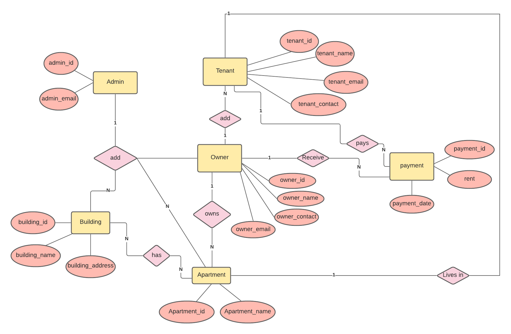

# Apartment-Management-System
Manage your apartment more efficiently. :houses:

Create 'apartmentdb' named database in phpMyAdmin
and import the .sql file into that.

email: admin@gmail.com
password:1234

## Here's The Entity Relation Diagram of our project :office:

